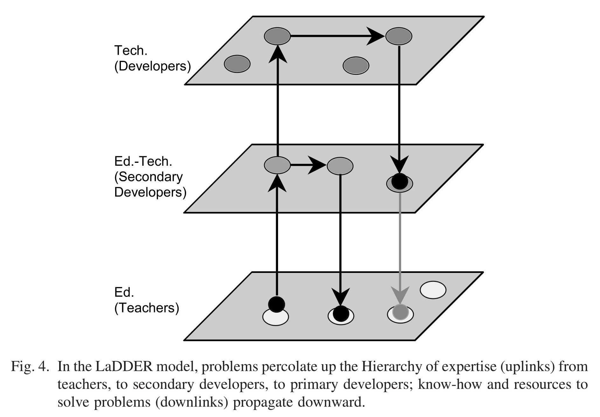

# A thematic index to the Boxer literature

## LaDDER model

First published in 2003's [Issues in Component Computing: A Synthetic Review? (diSessa et al, 2003)](<papers/Issues in Component Computing, A Synthetic Review - ILE (diSessa, Azevedo, Parnafes, 2003).pdf>),
the LaDDER (Layered Distributed Development of Educational Resources) model describes a pyramidal structure
for organising communities of participants with different technical competences. 

> The core goal of the model is to empower levels of participants with less technological expertise, 
especially teachers and students, to solve as many of their own problems as possible.

{width="512" title="Layered Distributed Development of Educational Resources"}

## Supporting Learners as Users

An exchange between Mark Guzdial and Andy diSessa in the pages of 1999's Journal of Computer Documentation.

[Supporting Learners as Users (Guzdial, 1999)](<../papers/Supporting Learners as Users - JCD (Guzdial, 1999).pdf>) - Mark's original article,
setting out the requirements software supporting learners - 

> But sometimes, the user's goal is not the same as the explicit task that the
software was designed for.

....

> Learners don't have a single goal or task when they are using an application
program, but two or more.

[How Should Students Learn (diSessa, 1999)](<papers/How Should Students Learn - JCD (diSessa, 1999).pdf>) - Andy's response,
developing the notion of the "committed learner" and how software for learners should support this model, in addition
to other elements of the hierarchy of needs.
